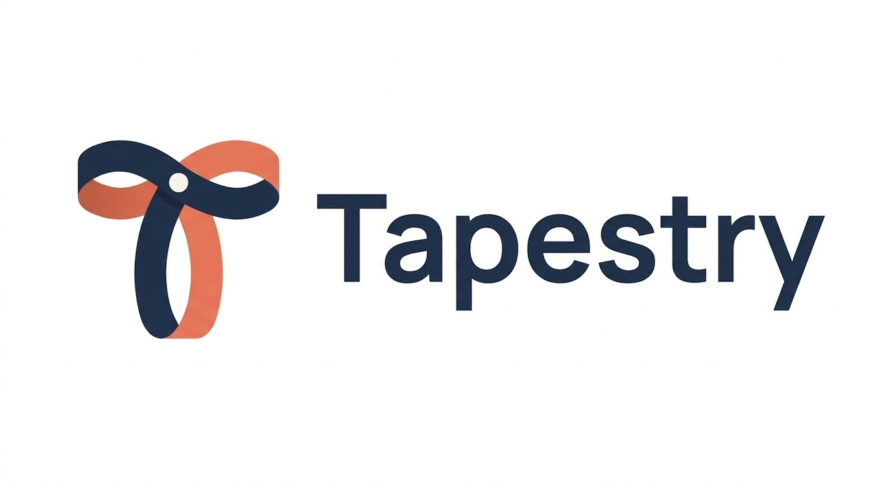
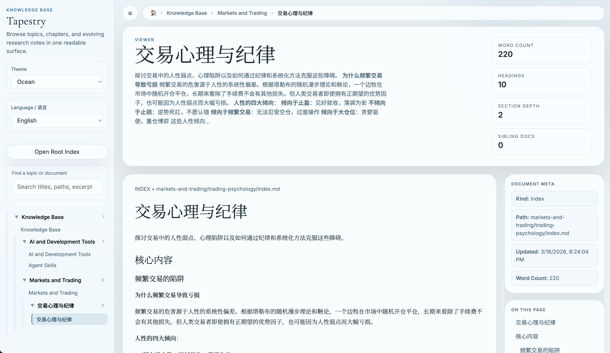
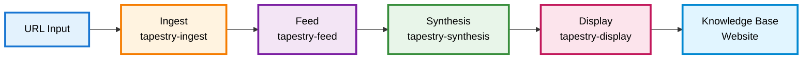
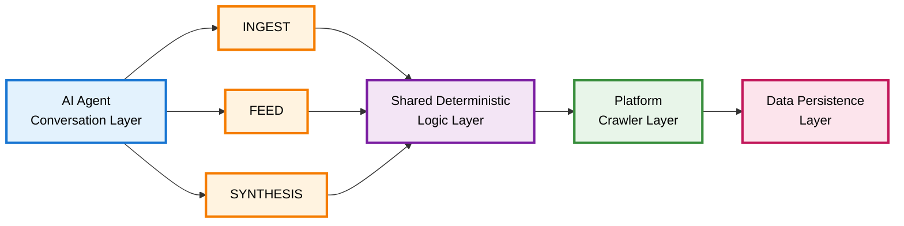

<div align="center">



# Tapestry — AI-Native Web Intelligence and Knowledge Base Skill Bundle

*Transform scattered web content into organized, searchable knowledge through natural conversation with your Agent assistant*

**Compatible Frameworks**: Claude Code, OpenClaw, Codex, and other mainstream agent frameworks

**Core Pages**
- [Install](https://natsufox.github.io/Tapestry/install.html)
- [Supported Sources](https://natsufox.github.io/Tapestry/supported-sources.html)
- [Use Cases](https://natsufox.github.io/Tapestry/use-cases.html)
- [FAQ](https://natsufox.github.io/Tapestry/faq.html)

> **If Tapestry helps you, please give the project a Star!**
>
> Your Star is not just recognition of the developer's work, but also motivation for continuous improvement. Every Star encourages us to develop more useful features, fix bugs and improve stability, enhance documentation and guides, and support more platforms and languages.
>
> [⭐ Star this project on GitHub](https://github.com/NatsuFox/Tapestry)

</div>

---

## 🎯 What is Tapestry?

Tapestry is an **AI-native skill pack** that transforms how you capture, organize, and synthesize web content. Instead of bookmarking links or copy-pasting articles, you get a complete workflow that crawls sources, normalizes content, and builds a structured knowledge base—all through natural conversation with your AI assistant.

---

## 👥 Who Should Use This?

- **Researchers** who need to track discussions across multiple platforms (Zhihu, Reddit, HN, X/Twitter)
- **Content curators** building organized knowledge repositories from diverse sources
- **Developers** who want to archive technical discussions and documentation systematically
- **Knowledge workers** tired of losing valuable insights scattered across bookmarks and tabs

## 💡 Problems It Solves

**Problem 1: Platform Fragmentation** 🌐
Valuable content lives across Zhihu, X, Reddit, Hacker News, Xiaohongshu, Weibo, WeChat Official Accounts, and countless blogs. Each platform has different structures, APIs, and access patterns. Tapestry provides unified crawlers that handle the complexity for you.

**Problem 2: Content Decay** ⏳
Web content disappears, gets edited, or becomes inaccessible. Tapestry captures content at the moment you care about it and preserves it in your local knowledge base forever.

**Problem 3: Knowledge Fragmentation** 🧩
Even when you save content, it stays isolated. Tapestry's synthesis skill uses AI to understand your content and organize it into a coherent, navigable knowledge structure.

---

## ✨ Key Features

- **🕷️ Multi-Platform Crawlers**: Native support for Zhihu, X/Twitter, Xiaohongshu, Weibo, Hacker News, Reddit, WeChat Official Accounts, and generic HTML pages
- **📦 Three-Layer Architecture**: Ingest (capture) → Feed (normalize) → Synthesis (analyze)
- **📖 Book-Like Knowledge Base**: Hierarchical organization with topics, chapters, automatic index generation, tags, categories, and rich metadata
- **🔍 Term Extraction**: Automatically extracts and explains key terms inline; hover over any term in the viewer to see its definition
- **🎨 Visual Frontend**: Browse your knowledge base through a clean, readable web interface with LaTeX rendering, Markdown support, and visual card generation
- **📤 Export**: Export any note, feed, or article as Markdown, HTML, or PDF directly from the viewer or via a skill command
- **🛜 RSS Subscriptions**: Subscribe to RSS feeds and automatically ingest new content as it arrives
- **🤖 AI-Native Workflow**: Designed for mainstream agent frameworks—work through natural language, not CLI commands
- **🔄 Deterministic Pipeline**: Reproducible captures with clear separation between facts and interpretation
- **🔧 Automatic Dependency Repair**: Intelligently detects and auto-fixes missing dependencies without manual intervention

---

## 🎉 Latest Progress

- **2026-03-24**:
  - 📚 Extensive knowledge base feature updates:
    - Automatically extracts terms and provides explanations (hover over a term to view)
    - Auto-generates article tags and categories; added more metadata fields
    - Article pages now support export as Markdown, HTML, and PDF
    - Pages recently modified or created now display a `New` badge for easy identification
  - Further refined knowledge base styling and layout

- **2026-03-23**:
  - 🛜 Added an RSS feed subscription Skill that supports automatic ingestion of RSS updates
  - Added a Skill for exporting knowledge base notes, feeds, or articles to local Markdown, HTML, or PDF documents

- **2026-03-22**:
  - Added a Release Building workflow and published the first release v0.0.1.
  - Added installation commands to the landing page; adjusted some text content and knowledge-base preview screenshots.

- **2026-03-21**:
  - Fixed path issues in the Skills script directories.
  - Added and documented the Claude plugin marketplace installation flow as well as the `npx skills` installation method.
  - Optimized the landing page's layout and styling to make it more polished.

- **2026-03-20**:
  - Fixed GitHub Actions errors to ensure all workflows pass correctly.
  - 🏠 Added a project homepage and deployed it to GitHub Pages — visit it at https://natsufox.github.io/Tapestry

- **2026-03-18**:
  - Optimized knowledge-base frontend layout and Markdown rendering.
  - Implemented direct URL navigation within the knowledge base.
  - Improved Markdown syntax compliance and formatting standards in the synthesis skill.
  - Added LaTeX rendering support in the knowledge-base frontend.
  - 🎨 Added visual card generation feature — inspired by [beilunyang/visual-note-card-skills](https://github.com/beilunyang/visual-note-card-skills).

- **2026-03-17**:
  - Added a WeChat Official Account article crawler.
  - Implemented Markdown rendering for the knowledge-base frontend.

---

## 🚀 Quick Start

### Demo: Understanding Tapestry in One Minute

**Ingest a Zhihu answer:**

First, open an agent framework (e.g. Claude Code), then call the tapestry skill directly:

```bash
/tapestry https://www.zhihu.com/question/12345/answer/67890
```

Or invoke it implicitly with natural language:

```bash
Fetch content https://www.zhihu.com/question/12345/answer/67890
```

Your AI assistant will:
1. Automatically recognize it's a Zhihu link
2. Select the Zhihu crawler
3. Capture full content (including comments)
4. Save in three formats:
   - `captures/` - Raw JSON
   - `feeds/` - Normalized JSON
   - `notes/` - Markdown notes

**Terminal Demo:**

<div align="center">
    
</div>

**🎬 Real-World Test Demonstration**

During this actual Zhihu content fetching test, Tapestry demonstrated powerful capabilities:

1. **Automatic Dependency Repair**: System detected missing package dependencies during connection setup and automatically completed installation and configuration
2. **Successful Content Retrieval**: After dependency repair, successfully completed full Zhihu content capture (including main text and comments)
3. **Knowledge Base Integration**: Captured content was automatically analyzed and integrated into the appropriate topics in the core knowledge base

This entire process is fully automated—users simply issue natural language commands, and the system handles all technical details.

**Organize into knowledge base:**

```bash
/tapestry synthesis
```

Or with natural language:

```bash
Synthesize recently collected content into my knowledge base
```

Your AI assistant will analyze the content and automatically decide which topic/chapter to place it under.

**Browse knowledge base:**

```
/tapestry display
```

Or with natural language:

```
Show my knowledge base as a website
```

Your AI assistant will generate a static frontend and start a local server (usually `http://localhost:8766`).

<div align="center">
  
  <p><em>Knowledge Base Visualization - Book-like hierarchical structure with topic navigation and chapter browsing</em></p>
</div>

---

### Installation

**Method 1: Claude Code plugin marketplace**

```bash
claude plugin marketplace add https://github.com/NatsuFox/Tapestry
claude plugin install tapestry@tapestry-skills
```

**Method 2: Universal npx skills install**

Installs the bundle-first `tapestry` skill pack:

```bash
npx skills add NatsuFox/Tapestry --skill tapestry

# Use this line only when you want a user-global install
# npx skills add NatsuFox/Tapestry --skill tapestry -g
```

All generated artifacts from skill-only installs live inside the installed Tapestry skill directory under `_data/`:

```text
~/.claude/skills/tapestry/_data/
~/.openclaw/skills/tapestry/_data/
~/.codex/skills/tapestry/_data/
```

**Method 3: Manual GitHub release bundle**

1. Download `tapestry-skills-vX.Y.Z.zip` or `tapestry-skills-vX.Y.Z.tar.gz` from the [GitHub Releases](https://github.com/NatsuFox/Tapestry/releases) page.
2. Extract the archive.
3. Copy the bundled `skills/tapestry` directory into your agent's skill directory.

```bash
# Claude Code
cp -r tapestry-skills-vX.Y.Z/skills/tapestry ~/.claude/skills/

# OpenClaw
cp -r tapestry-skills-vX.Y.Z/skills/tapestry ~/.openclaw/skills/

# Codex
cp -r tapestry-skills-vX.Y.Z/skills/tapestry ~/.codex/skills/
```

**Method 4: Local checkout (recommended for development and auto-updates)**

```bash
git clone https://github.com/NatsuFox/Tapestry.git
cd Tapestry

# Stable local copy
cp -r skills/tapestry ~/.claude/skills/
cp -r skills/tapestry ~/.openclaw/skills/
cp -r skills/tapestry ~/.codex/skills/

# Live development symlink
ln -s "$(pwd)/skills/tapestry" ~/.claude/skills/tapestry
ln -s "$(pwd)/skills/tapestry" ~/.openclaw/skills/tapestry
ln -s "$(pwd)/skills/tapestry" ~/.codex/skills/tapestry
```

### Verify Installation

Open your agent framework and type:

```
List available crawlers
```

If you see the list of supported platforms, installation is successful!

---

### Automatic Dependency Installation (Recommended)

Tapestry provides intelligent dependency installation that automatically detects your environment and installs required packages.

**How to Use:**

After installing the skill pack, simply type in your agent framework:

```
Set up the Tapestry project, and install Tapestry dependencies
```

**How It Works:**

1. **Environment Detection**: Automatically identifies your Python environment
   - Virtual environments (venv, virtualenv)
   - Conda environments
   - System Python
   - Package managers (pip, conda, poetry, uv)

2. **Dependency Analysis**: Scans `pyproject.toml` and identifies:
   - Core dependencies (httpx, pydantic, selectolax, etc.)
   - Optional dependencies (playwright for browser rendering)
   - Development tools (pytest, black, ruff, etc.)

3. **Generate Installation Plan**: Creates a detailed installation plan
   - Python package installation commands
   - System-level tools (e.g., `playwright install chromium`)
   - Optional components and recommendations

4. **User Confirmation**: Presents the plan and waits for your approval

5. **Execute Installation**: Runs approved commands and reports results

**Installation Options:**

- **Install All (Recommended)**: Core dependencies + browser support + tooling
- **Core Only**: Only required dependencies, skip optional packages
- **Custom Selection**: Manually choose which components to install

**Example Output:**

```
Environment: Python 3.11.5 in conda environment 'myenv'
Package Manager: conda (with pip fallback)

Installation Steps:
1. Install core dependencies:
   pip install -e .

2. Install browser support (recommended for JavaScript-heavy sites):
   pip install -e .[browser]
   playwright install chromium

3. [Optional] Install development tools:
   pip install -e .[dev]
```

**Important Notes:**

- If using system Python, you'll receive a warning and recommendation to create a virtual environment
- All installation operations require your explicit approval
- After installation, automatic verification ensures all packages import correctly

**Manual Installation (Alternative):**

If you prefer manual control, run the install from the installed `tapestry` skill directory:

```bash
# Example: Claude Code skill install
cd ~/.claude/skills/tapestry

# Install core dependencies
pip install -e .

# Install browser support (optional, for JavaScript rendering)
pip install -e .[browser]
playwright install chromium

# Install development tools (optional)
pip install -e .[dev]
```

---

### Common Use Cases

**Scenario 1: Track Technical Discussions**

Collect Hacker News discussions on a topic:

```
Ingest these Hacker News discussions:
https://news.ycombinator.com/item?id=123
https://news.ycombinator.com/item?id=456
```

Text analysis and synthesis (powered by your Agent's backbone model):

```
Synthesize these discussions and identify common viewpoints
```

Integrate results into the knowledge base:

```
Organize these viewpoints under the "Technical Discussions" topic in my knowledge base
```

**Scenario 2: Archive Research Materials**

Collect source material:

```
Ingest all highly-voted answers under this Zhihu question:
https://www.zhihu.com/question/12345
```

Manually specify a knowledge base topic to create:

```
Create a new topic in the knowledge base: Machine Learning Basics
```

Integrate collected content under the topic:

```
Organize these answers under the new topic
```

**Scenario 3: Content Curation**

Collect all notes from a Xiaohongshu user:

```
Ingest all notes from this Xiaohongshu user:
https://www.xiaohongshu.com/user/profile/xxx
```

Analyze user content to extract main interests and themes:

```
Generate a content summary for this user
```

Organize user content under a profile topic in the knowledge base:

```
Organize this content under the "Profiles" topic in my knowledge base, archived under a sub-chapter for user xxx
```

---

## ⚙️ Configuration and Merge Frequency

Below are some more detailed configuration options and features.

### Merge Frequency Settings

**Important**: Frequent merging into the knowledge base can lead to high overhead, especially if you perform a merge after every single ingest. Tapestry provides flexible merge strategies to balance real-time updates with performance.

Configuration file location: `skills/tapestry/config/tapestry.config.json`

```json
{
  "synthesis": {
    "mode": "auto",
    "kb_template": "default"
  }
}
```

### Merge Modes Explained

**1. Auto Mode (Intelligent Automatic)**
```json
"mode": "auto"
```

- **Behavior**: Agent automatically assesses the current accumulation of notes and decides whether to proceed with merge
- **Advantages**: Automated decision-making based on load, avoids unnecessary merge overhead
- **Use Cases**:
  - Daily usage, balancing real-time updates with performance
  - Uncertain when merging is most appropriate
  - Want AI to intelligently manage knowledge base updates

**How it works**:
- Agent evaluates the quantity and quality of unmerged notes
- Considers content relevance and importance
- Decides whether to merge immediately, delay, or batch merge
- Avoids forced merge after every single ingest

**2. Manual Mode (Manual Control)**
```json
"mode": "manual"
```

- **Behavior**: Synthesis only runs when explicitly invoked
- **Advantages**: Complete control over merge timing, zero automatic overhead
- **Use Cases**:
  - Batch capture content, organize later
  - Need to review notes before deciding to merge
  - Performance-critical scenarios

**Workflow Example**:
```bash
# Quickly capture multiple URLs
"Ingest this Zhihu answer: https://..."
"Ingest this HN discussion: https://..."
"Ingest this article: https://..."

# Later, selectively merge
"Synthesize the first answer into the knowledge base"
"Synthesize the HN discussion under technical discussions topic"
```

**3. Batch Mode (Batch Processing)**
```json
"mode": "batch"
```

- **Behavior**: After ingesting multiple URLs, merge all content in one pass
- **Advantages**: Minimizes merge count, suitable for large-scale content collection
- **Use Cases**:
  - Bulk import historical content
  - Periodic organization of large amounts of material
  - Need unified analysis of multiple sources

**Workflow Example**:
```bash
# Batch ingest
"Ingest these URLs:
https://example.com/1
https://example.com/2
https://example.com/3"

# Automatically triggers batch merge
# Agent analyzes all content and organizes into knowledge base
```

### Deterministic Mode

If you need to force knowledge base updates after every ingest:

```json
{
  "synthesis": {
    "mode": "deterministic",
    "kb_template": "default"
  }
}
```

- **Behavior**: Immediately executes knowledge base merge after each ingest
- **Advantages**: Knowledge base always stays up-to-date
- **Disadvantages**: High overhead, frequent merging may impact performance
- **Use Cases**:
  - Real-time knowledge base update requirements
  - Low ingest frequency (few times per day)
  - Performance is not a primary concern

### Performance Considerations

**Merge Overhead Sources**:
- Reading and analyzing existing knowledge base structure
- Semantic matching and topic decision-making
- Updating multiple `index.md` files
- Maintaining navigation and cross-references

**Recommended Strategies**:
- **Daily use**: `auto` mode (recommended)
- **Bulk import**: `batch` mode
- **Fine control**: `manual` mode
- **Real-time updates**: `deterministic` mode (use cautiously)

**Optimization Tips**:
- Avoid merging individually after ingesting large amounts of content in a short time
- Use `batch` or `auto` mode to let Agent optimize merge timing
- Update knowledge base regularly rather than frequently
- Consider batch processing historical content during off-hours

### Modifying Configuration

```bash
# Edit configuration directly
vim skills/tapestry/config/tapestry.config.json

# Or let Agent help you modify
"Change merge mode to manual"
"Enable auto mode intelligent merging"
```

Configuration takes effect immediately, no restart required.

---

## 📋 Workflow Overview



---

## 🛠️ Architecture Design

Tapestry is **not a traditional Python library**—it's a skill pack meticulously designed for AI agent framework workflow models.

### Core Design Philosophy



### Layered Responsibilities

**1. Skill Workflow Layer** (`SKILL.md` files)
- Defines high-level workflow logic in natural language
- Describes trigger conditions, execution steps, and output expectations
- Remains human-readable for easy understanding and maintenance
- Automatically invoked through Agent framework intent recognition

**2. Shared Deterministic Logic Layer** (`_src/`)
- Provides reusable, testable core functionality
- Handles HTTP requests, HTML parsing, and data normalization
- Implements the crawler registry and URL routing mechanism
- Ensures deterministic and reproducible data processing

**3. Platform Crawler Implementation Layer** (`_src/crawlers/`)
- One independent module per platform
- Handles platform-specific APIs, DOM structures, and authentication
- Unified interface: `CrawlerDefinition` + `CrawlHandler`
- Hot-pluggable, easy to extend with new platforms

**4. Data Persistence Layer**
- Three artifact types:
  - **Capture**: Raw crawled data (JSON)
  - **Feed**: Normalized feed (JSON)
  - **Note**: Human-readable notes (Markdown)
- Knowledge base uses a book-like hierarchical structure
- All artifacts are timestamped for version traceability

### Data Flow

```
URL Input
  │
  ├─→ Router (domain resolution)
  │
  ├─→ Registry (crawler matching)
  │
  ├─→ Crawler (platform capture)
  │     │
  │     ├─→ Fetcher (HTTP requests)
  │     ├─→ Parser (content parsing)
  │     └─→ Generates CrawlerProduct
  │
  ├─→ Store (persistence)
  │     │
  │     ├─→ captures/{timestamp}.json
  │     ├─→ feeds/{timestamp}.json
  │     └─→ notes/{timestamp}.md
  │
  └─→ Handoff (pass to downstream skills)
        │
        ├─→ Feed Skill (optional formatting)
        ├─→ Synthesis Skill (AI analysis)
        └─→ Display Skill (visualization)
```

### Extensibility Design

**Adding a New Crawler**
1. Create a module in `_src/crawlers/new_platform/`
2. Implement `CrawlerDefinition` and `CrawlHandler`
3. Register in `registry.py`
4. Add a corresponding Feed spec to `feed/_specs/`

**Adding a New Skill**
1. Create a `SKILL.md` to define the workflow
2. Add execution scripts in `_scripts/`
3. Reuse shared logic from `_src/`
4. Update documentation and tests

This architecture ensures:
- ✅ **Separation of Concerns**: Workflow, logic, and implementation are distinct
- ✅ **Testability**: Deterministic logic layer is fully unit-testable
- ✅ **Extensibility**: New platforms and skills are easy to add
- ✅ **Maintainability**: Natural language workflows + clear code structure

---

## 📚 Supported Sources

| Platform | Coverage | Notes |
|----------|----------|-------|
| 🇨🇳 Zhihu | Questions, Answers, Articles, Profiles | Reverse-engineered API |
| 🐦 X/Twitter | Posts, Threads | Public pages only |
| 📱 Xiaohongshu | Notes, Profiles | Public content |
| 🇨🇳 Weibo | Posts | Public posts |
| 🔶 Hacker News | Discussions | Full comment trees |
| 🤖 Reddit | Threads | Public threads |
| 🇨🇳 WeChat Official Accounts | Articles | Public articles |
| 🌐 Generic HTML | Any webpage | Fallback crawler |

---

## 📖 Knowledge Base Structure

Tapestry organizes content into a **book-like hierarchy**:

```
knowledge-base/
├── index.md                    # Root navigation
├── topic-1/
│   ├── index.md               # Topic overview
│   ├── chapter-1/
│   │   ├── index.md          # Chapter content
│   │   └── artifacts/        # Supporting files
│   └── chapter-2/
└── topic-2/
```

The synthesis skill automatically:
- Decides where content belongs based on semantic fit
- Creates new topics/chapters when needed
- Updates all parent `index.md` files for navigation
- Maintains governance rules for consistency

---

## 🎨 Visual Frontend

Generate a browsable website from your knowledge base:

```bash
# Your AI assistant will run this for you when you say:
# "Show me my knowledge base as a website"

python skills/tapestry/display/_scripts/publish_viewer.py
python -m http.server 8766 --directory knowledge-base/_viewer
```

Visit `http://localhost:8766` to browse your organized content with:
- Proper topic/chapter navigation and book-like hierarchy
- Markdown and LaTeX rendering
- Inline term definitions (hover over highlighted terms)
- Article tags, categories, and metadata
- `New` badge on recently added or updated pages
- One-click export of any article as Markdown, HTML, or PDF

---

## 🧪 Testing

Validation lives alongside the code:

```bash
cd skills/tapestry/_tests
pytest
```

Tests cover the shared `_src` support code and registry behavior.

---

## ❓ Frequently Asked Questions

#### What is Tapestry?

Tapestry is a skill pack for agent frameworks that crawls web content from multiple platforms and organizes it into a structured knowledge base. It's not a traditional library or tool, but an AI-native workflow that works through natural language conversation.

#### Do I need programming experience?

No. You simply talk to your AI assistant naturally to use Tapestry. Most agent frameworks support both explicit skill invocation and implicit natural language commands.

#### Will I get blocked by platforms?

Tapestry respects platform rate limits and robots.txt. For public content, the risk is low. However:
- Don't crawl too frequently
- Follow platform Terms of Service
- Only crawl publicly accessible content

#### Where is data stored?

All data is stored on your local filesystem. Tapestry does not send data to any external servers (except the original platforms being crawled).

#### How do I backup my knowledge base?

Simply backup the entire project directory, especially `captures/`, `feeds/`, `notes/`, and `knowledge-base/` directories.

#### How do I add a crawler for a new platform?

See the Contributing section below. Basic steps:
1. Create new module in `_src/crawlers/`
2. Implement `CrawlerDefinition` and `CrawlHandler`
3. Register in `registry.py`
4. Add Feed spec to `feed/_specs/`
5. Write tests

#### What if I encounter issues?

- Check [Issues](https://github.com/NatsuFox/Tapestry/issues) for similar problems
- Create a new [Bug Report](https://github.com/NatsuFox/Tapestry/issues/new?template=bug_report.md)
- Join [Discussions](https://github.com/NatsuFox/Tapestry/discussions) to ask questions

---

## 📚 Usage and Reference

The public repository keeps its durable reference surface in this README and the root-level project files. The `docs/` directory is now treated as a local workspace and is no longer part of the remote repo.

**Core sections in this README**
- `Installation` - setup paths and verification steps
- `Configuration and Merge Frequency` - configuration shape, merge modes, and tradeoffs
- `Workflow Overview` - everyday usage flow
- `Architecture Design` - layered responsibilities, data flow, and extension seams
- `Supported Sources` - currently supported platforms
- `Frequently Asked Questions` - troubleshooting and operational boundaries

**Root-level project files**
- [Contributing Guide](CONTRIBUTING.md) - How to contribute to Tapestry
- [Changelog](CHANGELOG.md) - Version history and updates
- [Roadmap](ROADMAP.md) - Future plans and features

---

## 🤝 Contributing

We welcome all forms of contributions! Whether it's new features, bug fixes, documentation improvements, or usage feedback—everything helps make Tapestry better.

### Ways to Contribute

**1. Add New Platform Crawlers** 🕷️
- Create a new platform module under `_src/crawlers/`
- Implement the `CrawlerDefinition` and `CrawlHandler` interfaces
- Register the crawler in `registry.py`
- Add the corresponding Feed spec to `feed/_specs/`
- Write unit tests to validate crawler behavior

**2. Improve Feed Specifications** 📝
- Refine the platform-specific formatting rules in `feed/_specs/`
- Ensure specs accurately reflect platform characteristics
- Maintain consistency with `_shared-standard.md`

**3. Enhance the Visual Frontend** 🎨
- Improve the viewer interface in `display/_ui/`
- Optimize navigation UX and content presentation
- Ensure responsive design and accessibility

**4. Refine Knowledge Base Governance** 📚
- Optimize the organization rules in `_kb_rules/`
- Improve topic classification and chapter-placement logic
- Increase knowledge base maintainability

**5. Documentation and Examples** 📖
- Add use cases and best practices
- Expand the FAQ
- Provide examples for additional platforms

### Submitting a Pull Request

Before submitting a PR, please ensure:

1. **Code Quality**
   - Follow the project's existing code style
   - Add necessary type annotations and docstrings
   - Ensure code passes all tests

2. **Test Coverage**
   ```bash
   cd skills/tapestry/_tests
   pytest
   ```
   - Add unit tests for new functionality
   - Ensure all existing tests pass
   - Cover critical paths and edge cases

3. **Commit Messages**
   - Format: `<type>(<scope>): <subject>`
   - Types: `feat`, `fix`, `docs`, `style`, `refactor`, `test`, `chore`
   - Example:
     ```
     feat(crawlers): add Bilibili video crawler
     fix(zhihu): handle deleted answers gracefully
     docs(readme): update installation instructions
     ```

4. **PR Description**
   - Clearly state the motivation and goal of the change
   - List the main changes
   - Reference related issue numbers (if any)
   - Include test steps or screenshots where applicable

### PR Template

```markdown
## Change Type
- [ ] New feature
- [ ] Bug fix
- [ ] Documentation update
- [ ] Performance improvement
- [ ] Code refactor

## Description
<!-- Briefly describe what this PR does -->

## Motivation and Context
<!-- Why is this change needed? What problem does it solve? -->

## Testing
<!-- How was this change verified? Provide test steps -->

## Related Issues
<!-- Related issue numbers, e.g. #123 -->

## Checklist
- [ ] Code follows the project style guide
- [ ] Tests have been added
- [ ] All tests pass
- [ ] Documentation has been updated
- [ ] Commit messages are clear and descriptive
```

### Development Environment Setup

```bash
# Clone the repository
git clone https://github.com/NatsuFox/Tapestry.git
cd Tapestry

# Run tests
cd skills/tapestry/_tests
pytest -v

# Install to your agent framework for testing (symlink for live development)
ln -s "$(pwd)/skills/tapestry" ~/.claude/skills/tapestry
```

### Code of Conduct

- Respect all contributors
- Keep discussions constructive
- Accept constructive criticism
- Focus on what is best for the project
- Show empathy toward community members

### Need Help?

- Browse [Issues](https://github.com/NatsuFox/Tapestry/issues) for tasks to contribute to
- Issues labeled `good first issue` are great for new contributors
- Issues labeled `help wanted` need community assistance
- Have questions? Open an issue or start a discussion

---

## 📄 License

This project is licensed under the MIT License - see the [LICENSE](LICENSE) file for details.

---

<div align="center">

**Built with ❤️ for Agent Frameworks**

*Transform scattered web content into organized knowledge*

[⬆ Back to Top](#tapestry--ai-native-web-intelligence-and-knowledge-base-skill-bundle)

</div>
