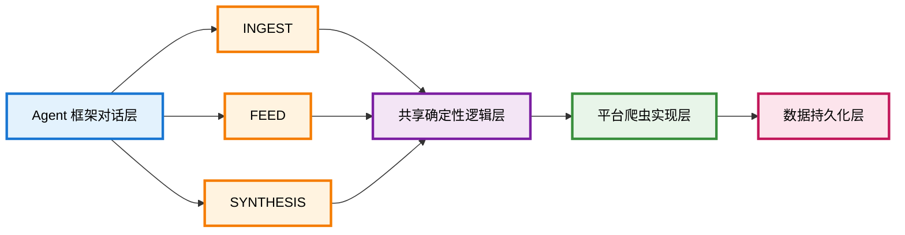

<div align="center">


**AI 原生的网络书签知识库 | AI-Native Web Bookmark Knowledge Base**

*通过与 Agent 助手的自然对话，将分散的网络内容转化为有组织、可搜索的知识库*

*Transform scattered web content into organized, searchable knowledge through natural conversation with your Agent assistant*

[](https://opensource.org/licenses/MIT)


[中文](#中文) | [English](README.en.md)

### 🏠 项目主页 | Project Homepage

https://natsufox.github.io/Tapestry


### ⭐ 支持项目 | Support the Project

> **如果 Tapestry 对你有帮助，请给项目一个 Star！**
>
> 你的 Star 不仅是对开发者工作的认可，更是推动项目持续改进的动力。每一个 Star 都会激励我们开发更多实用功能、修复 Bug 并提升稳定性、完善文档和使用指南、支持更多平台和语言。
>
> **If Tapestry helps you, please give the project a Star!**
>
> Your Star is not just recognition of the developer's work, but also motivation for continuous improvement. Every Star encourages us to develop more useful features, fix bugs and improve stability, enhance documentation and guides, and support more platforms and languages.
>
> [⭐ Star this project on GitHub](https://github.com/NatsuFox/Tapestry)

</div>

---

### 🎯 Tapestry 是什么？

Tapestry 是一个 **AI 原生的技能包**，它彻底改变了你捕获、整理和综合网络内容的方式。不再需要收藏链接或复制粘贴文章，你将获得一个完整的工作流：爬取来源、规范化内容、构建结构化知识库——全部通过与 Agent 框架的自然对话完成。

**兼容框架**：Claude Code、OpenClaw、Codex 等主流 Agent 框架

---

### 🎉 最新进展

- **2026-03-24**：
  - 📚 更新了大量知识库特性
    - 自动抽取术语并提供解释（悬浮于术语上即可查看）
    - 自动生成文章标签和分类，添加了更多元数据
    - 文章页面现已支持导出为 Markdown, HTML 和 PDF 格式
    - 对于近期修改或创建的页面，会显示 `New` 标签以便识别
  - 进一步优化了知识库的样式和布局

- **2026-03-23**：
  - 🛜 增加了订阅 RSS 源的 Skill，支持自动摄取 RSS 更新内容
  - 增加了导出知识库 notes, feeds 或 articles 到本地 Markdown、HTML 或 PDF 格式文档的 Skill

- **2026-03-22**：
  - 添加了 Release Building 的 Workflow，并发布了第一个版本 v0.0.1
  - 在落地页中添加了安装命令，调整了部分文本内容和知识库展示截图

- **2026-03-21**：
  - 修复了 Skills 脚本目录的路径问题
  - 添加了 Claude 插件市场的安装方法和说明，以及 npx skills 的安装方式
  - 优化了落地页的布局和样式，使之更加美观

- **2026-03-20**：
  - 修复了 Github Actions 的错误，确保所有 Workflow 都能正确通过
  - 🏠 添加了项目主页，并适配到了 Github Pages 上，访问地址为 https://natsufox.github.io/Tapestry

- **2026-03-18**：
  - 优化了知识库前端样式布局和 Markdown 渲染
  - 实现了知识库 URL 的直接跳转
  - 优化了 synthesis skill 的 Markdown 语法遵循和格式规范
  - 实现了知识库前端对 LaTeX 的渲染支持
  - 🎨 添加了生成视觉卡片的特性
    - 受到项目 [beilunyang/visual-note-card-skills](https://github.com/beilunyang/visual-note-card-skills) 的启发，感谢这位大佬的工作

- **2026-03-17**
  - 新增微信公众号文章爬虫
  - 实现了知识库前端的 Markdown 渲染效果

---

### 🚀 快速开始

#### 演示：一分钟了解 Tapestry

**摄取一个知乎回答：**

首先打开一个 Agent 框架（如 Claude Code）：

```bash
 ▐▛███▜▌   Claude Code v2.1.81
▝▜█████▛▘  Opus 4.6 (1M context) with max effort · API Usage Billing
  ▘▘ ▝▝    

─────────────────────────────────────────────────────────────────────────────────────────────────────────────────────────────────────
❯ （下文展示的命令都在这里输入）
─────────────────────────────────────────────────────────────────────────────────────────────────────────────────────────────────────
  ⏵⏵ bypass permissions on (shift+tab to cycle)
```

然后调用 tapestry skill 爬取来源：

```bash
/tapestry https://www.zhihu.com/question/12345/answer/67890
```

也可以用类似含义的自然语言隐式调用：

```bash
获取内容 https://www.zhihu.com/question/12345/answer/67890
```

AI 助手会：
1. 自动识别这是知乎链接
2. 选择知乎爬虫
3. 抓取完整内容（包括评论）
4. 保存为三种格式：
   - `captures/` - 原始 JSON
   - `feeds/` - 规范化 JSON
   - `notes/` - Markdown 笔记

**终端演示：**

<div align="center">
    
</div>

**🎬 实际测试展示**

在这次知乎内容抓取的实际测试中，Tapestry 展现了强大的能力：

1. **自动依赖修复**：在建立连接过程中，系统检测到缺失的包依赖，自动完成安装和配置
2. **成功获取内容**：依赖修复后，顺利完成知乎内容的完整抓取（包括正文和评论）
3. **知识库整合**：抓取的内容已自动分析并整合到核心知识库的相应主题下

这个过程完全自动化，用户只需发出自然指令，系统会处理所有技术细节。

**组织到知识库：**

```bash
/tapestry synthesis
```

同样地，自然语言表达：

```bash
将近期收集的内容整合到知识库
```

AI 助手会分析内容并自动决定放在哪个主题/章节下。

**浏览知识库：**

使用如下命令启动知识库前端：

```
/tapestry display
```

或自然语言指令：

```
把我的知识库显示为网站
```

AI 助手会生成静态前端并启动本地服务器（通常是 `http://localhost:8766`）。

<div align="center">
  
  <p><em>知识库可视化界面 - 书籍式层次结构，支持主题导航和章节浏览</em></p>
</div>

#### 安装

**方法 1：Claude Code 插件市场安装**

```bash
claude plugin marketplace add https://github.com/NatsuFox/Tapestry
claude plugin install tapestry@tapestry-skills
```

**方法 2：通用 npx skills 安装**

安装 bundle-first 的 `tapestry` 技能包：

```bash
npx skills add NatsuFox/Tapestry --skill tapestry

# 仅在你需要用户级全局安装时，才使用该行命令
# npx skills add NatsuFox/Tapestry --skill tapestry -g
```

通过纯技能安装方式产生的所有数据，都会写入已安装的 Tapestry 技能目录下的 `_data/`：

```text
~/.claude/skills/tapestry/_data/
~/.openclaw/skills/tapestry/_data/
~/.codex/skills/tapestry/_data/
```

**方法 3：手动安装 GitHub Release 包**

1. 从 [GitHub Releases](https://github.com/NatsuFox/Tapestry/releases) 页面下载 `tapestry-skills-vX.Y.Z.zip` 或 `tapestry-skills-vX.Y.Z.tar.gz`
2. 解压归档文件
3. 将其中的 `skills/tapestry` 目录复制到你的 Agent 技能目录

```bash
# Claude Code
cp -r tapestry-skills-vX.Y.Z/skills/tapestry ~/.claude/skills/

# OpenClaw
cp -r tapestry-skills-vX.Y.Z/skills/tapestry ~/.openclaw/skills/

# Codex
cp -r tapestry-skills-vX.Y.Z/skills/tapestry ~/.codex/skills/
```

**方法 4：本地检出（推荐用于开发和自动更新）**

```bash
git clone https://github.com/NatsuFox/Tapestry.git
cd Tapestry

# 稳定本地复制
cp -r skills/tapestry ~/.claude/skills/
cp -r skills/tapestry ~/.openclaw/skills/
cp -r skills/tapestry ~/.codex/skills/

# 开发期实时符号链接
ln -s "$(pwd)/skills/tapestry" ~/.claude/skills/tapestry
ln -s "$(pwd)/skills/tapestry" ~/.openclaw/skills/tapestry
ln -s "$(pwd)/skills/tapestry" ~/.codex/skills/tapestry
```

#### 验证安装

打开你的 Agent 框架，输入：

```
列出可用的爬虫
```

如果看到支持的平台列表，说明安装成功！

#### 自动安装依赖（推荐）

Tapestry 提供了智能依赖安装功能，可以自动检测你的环境并安装所需的依赖包。

**使用方法：**

安装技能包后，只需在 Agent 框架中输入：

```
设置 Tapestry 项目，并安装 Tapestry 依赖
```

**工作原理：**

1. **环境检测**：自动识别你的 Python 环境
   - 虚拟环境（venv、virtualenv）
   - Conda 环境
   - 系统 Python
   - 包管理器（pip、conda、poetry、uv）

2. **依赖分析**：扫描 `pyproject.toml` 并识别：
   - 核心依赖（httpx、pydantic、selectolax 等）
   - 可选依赖（playwright 用于浏览器渲染）
   - 开发工具（pytest、black、ruff 等）

3. **生成安装计划**：创建详细的安装方案
   - Python 包安装命令
   - 系统级工具（如 `playwright install chromium`）
   - 可选组件和推荐

4. **用户确认**：展示计划并等待你的批准

5. **执行安装**：运行批准的命令并报告结果

**安装选项：**

- **全部安装（推荐）**：核心依赖 + 浏览器支持 + 后续工具
- **仅核心**：只安装必需的依赖，跳过可选包
- **自定义选择**：手动选择要安装的组件

**示例输出：**

```
环境：Python 3.11.5 在 conda 环境 'myenv' 中
包管理器：conda（pip 作为后备）

安装步骤：
1. 安装核心依赖：
   pip install -e .

2. 安装浏览器支持（推荐用于 JavaScript 密集型网站）：
   pip install -e .[browser]
   playwright install chromium

3. [可选] 安装开发工具：
   pip install -e .[dev]
```

**重要提示：**

- 如果使用系统 Python，会收到警告并建议创建虚拟环境
- 所有安装操作都需要你的明确批准
- 安装完成后会自动验证所有包是否正确导入

**手动安装（备选方案）：**

如果你更喜欢手动控制，请在已安装的 `tapestry` 技能目录中执行安装：

```bash
# 示例：Claude Code 已安装技能目录
cd ~/.claude/skills/tapestry

# 安装核心依赖
pip install -e .

# 安装浏览器支持（可选，用于 JavaScript 渲染）
pip install -e .[browser]
playwright install chromium

# 安装开发工具（可选）
pip install -e .[dev]
```

#### 常见使用场景

**场景 1：追踪技术讨论**

收集 Hacker News 上关于某个技术话题的讨论：

```
摄取这些 Hacker News 讨论：
https://news.ycombinator.com/item?id=123
https://news.ycombinator.com/item?id=456
```

文本分析和综合（这算是 Agent Backbone 模型自身的能力支持，和 Tapestry 关系不大）：

```
综合这些讨论，找出共同的观点
```

将分析结果整合到知识库：

```
把这些观点组织到知识库的“技术讨论”主题下
```

**场景 2：归档研究资料**

收集原始资料：

```
摄取这个知乎问题下的所有高赞回答 https://www.zhihu.com/question/12345
```

手动指定知识库话题创建：

```
在知识库中创建一个新主题：机器学习基础
```

将收集的内容整合到知识库话题内：

```
把这些回答组织到新主题下
```

**场景 3：内容策展**

收集某个用户的所有小红书笔记内容：

```
摄取这个小红书用户的所有笔记：
https://www.xiaohongshu.com/user/profile/xxx
```

对用户内容进行分析，提取主要兴趣和主题（这也是 Agent Backbone 模型的能力）：

```
生成这个用户的内容摘要
```

将用户内容整合到知识库的个人档案主题下。

```
把这些内容组织到知识库的“个人档案”主题下
```

如果需要精细的整理，还可以在知识库中创建一个专门的个人档案话题：

```
把这些内容组织到知识库的“个人档案”主题下，归档到用户 xxx 的子章节里
```


---

### ⚙️ 配置与合并频率

如下是一些更细节的配置和功能。

#### 合并频率设置

**重要提醒**：频繁合并到知识库会导致高开销，特别是在每次摄取后都执行合并时。Tapestry 提供了灵活的合并策略来平衡实时性和性能。

配置文件位置：`skills/tapestry/config/tapestry.config.json`

```json
{
  "synthesis": {
    "mode": "auto",
    "kb_template": "default"
  }
}
```

#### 合并模式详解

**1. Auto 模式（智能自动）**
```json
"mode": "auto"
```

- **行为**：Agent 根据当前笔记积累情况自动评估是否执行合并
- **优势**：基于负载的自动化决策，避免不必要的合并开销
- **适用场景**：
  - 日常使用，平衡实时性和性能
  - 不确定何时合并最合适
  - 希望 AI 智能管理知识库更新

**工作原理**：
- Agent 评估当前未合并笔记的数量和质量
- 考虑内容的相关性和重要性
- 决定是立即合并、延迟合并还是批量合并
- 避免在每次摄取后强制执行合并

**2. Manual 模式（手动控制）**
```json
"mode": "manual"
```

- **行为**：仅在明确调用时执行合并
- **优势**：完全控制合并时机，零自动开销
- **适用场景**：
  - 批量捕获内容，稍后统一整理
  - 需要先审查笔记再决定是否合并
  - 对性能要求极高的场景

**工作流示例**：
```bash
# 快速捕获多个 URL
"摄取这个知乎回答：https://..."
"摄取这个 HN 讨论：https://..."
"摄取这篇文章：https://..."

# 稍后选择性合并
"把第一个回答综合到知识库"
"把 HN 讨论综合到技术讨论主题下"
```

**3. Batch 模式（批量处理）**
```json
"mode": "batch"
```

- **行为**：摄取多个 URL 后，一次性合并所有内容
- **优势**：最小化合并次数，适合大规模内容采集
- **适用场景**：
  - 批量导入历史内容
  - 定期整理大量资料
  - 需要统一分析多个来源

**工作流示例**：
```bash
# 批量摄取
"摄取这些 URL：
https://example.com/1
https://example.com/2
https://example.com/3"

# 自动触发批量合并
# Agent 会分析所有内容并统一组织到知识库
```

#### 确定性选项（Deterministic Mode）

如果需要在每次摄取后强制更新知识库，可以使用确定性模式：

```json
{
  "synthesis": {
    "mode": "deterministic",
    "kb_template": "default"
  }
}
```

- **行为**：每次摄取后立即执行知识库合并
- **优势**：知识库始终保持最新状态
- **劣势**：高开销，频繁合并可能影响性能
- **适用场景**：
  - 实时知识库更新需求
  - 摄取频率较低（每天几次）
  - 性能不是主要考虑因素

#### 性能考虑

**合并开销来源**：
- 读取和分析现有知识库结构
- 语义匹配和主题决策
- 更新多个 `index.md` 文件
- 维护导航和交叉引用

**推荐策略**：
- **日常使用**：`auto` 模式（推荐）
- **批量导入**：`batch` 模式
- **精细控制**：`manual` 模式
- **实时更新**：`deterministic` 模式（谨慎使用）

**优化建议**：
- 避免在短时间内摄取大量内容后逐个合并
- 使用 `batch` 或 `auto` 模式让 Agent 优化合并时机
- 定期而非频繁地更新知识库
- 考虑在非工作时间批量处理历史内容

#### 修改配置

编辑配置文件：
```bash
# 编辑配置
vim skills/tapestry/config/tapestry.config.json

# 或让 Agent 帮你修改
"把合并模式改为 manual"
"启用 auto 模式的智能合并"
```

配置立即生效，无需重启。

---

### 📋 工作流概览


---

### 🛠️ 架构设计

Tapestry **不是传统的 Python 库**——它是为 Agent 框架的工作流模型精心设计的技能包。

#### 核心设计理念



#### 分层职责

**1. 技能工作流层** (`SKILL.md` 文件)
- 用自然语言定义高级工作流逻辑
- 描述技能的触发条件、执行步骤和输出期望
- 保持人类可读性，便于理解和维护
- 通过 Agent 框架的意图识别自动调用

**2. 共享确定性逻辑层** (`_src/`)
- 提供可重用、可测试的核心功能
- 处理 HTTP 请求、HTML 解析、数据规范化
- 实现爬虫注册表和 URL 路由机制
- 确保数据处理的确定性和可重现性

**3. 平台爬虫实现层** (`_src/crawlers/`)
- 每个平台一个独立模块
- 处理平台特定的 API、DOM 结构、认证机制
- 统一接口：`CrawlerDefinition` + `CrawlHandler`
- 支持热插拔，易于扩展新平台

**4. 数据持久化层**
- 三种制品类型：
  - **Capture**: 原始抓取数据（JSON）
  - **Feed**: 规范化订阅源（JSON）
  - **Note**: 人类可读笔记（Markdown）
- 知识库采用书籍式层次结构
- 所有制品带时间戳，支持版本追溯

#### 数据流转

```
URL 输入
  │
  ├─→ Router (域名解析)
  │
  ├─→ Registry (爬虫匹配)
  │
  ├─→ Crawler (平台抓取)
  │     │
  │     ├─→ Fetcher (HTTP 请求)
  │     ├─→ Parser (内容解析)
  │     └─→ 生成 CrawlerProduct
  │
  ├─→ Store (持久化)
  │     │
  │     ├─→ captures/{timestamp}.json
  │     ├─→ feeds/{timestamp}.json
  │     └─→ notes/{timestamp}.md
  │
  └─→ Handoff (传递给下游技能)
        │
        ├─→ Feed Skill (可选格式化)
        ├─→ Synthesis Skill (AI 分析)
        └─→ Display Skill (可视化展示)
```

#### 扩展性设计

**添加新爬虫**
1. 在 `_src/crawlers/new_platform/` 创建模块
2. 实现 `CrawlerDefinition` 和 `CrawlHandler`
3. 在 `registry.py` 中注册
4. 添加对应的 Feed 规范到 `feed/_specs/`

**添加新技能**
1. 创建 `SKILL.md` 定义工作流
2. 在 `_scripts/` 添加执行脚本
3. 复用 `_src/` 中的共享逻辑
4. 更新文档和测试

这种架构确保了：
- ✅ **关注点分离**：工作流、逻辑、实现各司其职
- ✅ **可测试性**：确定性逻辑层完全可单元测试
- ✅ **可扩展性**：新平台、新技能易于添加
- ✅ **可维护性**：自然语言工作流 + 清晰的代码结构

---

### 📚 支持的来源

| 平台 | 覆盖范围 | 备注 |
|------|---------|------|
| 🇨🇳 知乎 | 问题、回答、文章、个人主页 | 逆向工程 API |
| 🐦 X/Twitter | 帖子、话题串 | 仅公开页面 |
| 📱 小红书 | 笔记、个人主页 | 公开内容 |
| 🇨🇳 微博 | 帖子 | 公开帖子 |
| 🔶 Hacker News | 讨论 | 完整评论树 |
| 🤖 Reddit | 话题串 | 公开话题串 |
| 🌐 通用 HTML | 任何网页 | 后备爬虫 |

---

### 📖 知识库结构

Tapestry 将内容组织成**书籍式层次结构**：

```
knowledge-base/
├── index.md                    # 根导航
├── topic-1/
│   ├── index.md               # 主题概览
│   ├── chapter-1/
│   │   ├── index.md          # 章节内容
│   │   └── artifacts/        # 支持文件
│   └── chapter-2/
└── topic-2/
```

综合技能会自动：
- 根据语义匹配决定内容归属
- 在需要时创建新主题/章节
- 更新所有父级 `index.md` 文件以便导航
- 维护治理规则以保持一致性

---

### 🎨 可视化前端

从你的知识库生成可浏览的网站：

```bash
# 当你说"把我的知识库显示为网站"时，Claude 会为你运行：

python skills/tapestry/display/_scripts/publish_viewer.py
python -m http.server 8766 --directory knowledge-base/_viewer
```

访问 `http://localhost:8766` 以浏览你的有组织内容，带有适当的导航和结构。

---

### ❓ 常见问题

#### 什么是 Tapestry？

Tapestry 是一个为 Agent CLI 设计的技能包，用于从多个平台爬取网络内容并组织成结构化的知识库。它不是传统的库或工具，而是通过自然语言对话工作的 AI 原生工作流。

#### 我需要编程经验吗？

不需要。你只需要与 Agent 自然对话即可使用 Tapestry，具体调用 Skill 的方式不尽相同，但主流的 Agent 框架都支持显式指定 Skill 触发和自然语言隐式调用两种方式。

#### 会被平台封禁吗？

Tapestry 尊重平台的速率限制和 robots.txt。对于公开内容，风险很低。但请：
- 不要过度频繁地爬取
- 遵守平台的服务条款
- 仅爬取公开可访问的内容

#### 数据存储在哪里？

所有数据都存储在你的本地文件系统中。Tapestry 本身不会将个人数据发送到任何外部服务器，但和 Agent 交互的数据会不可避免地发送给 API 提供商，如 OpenAI, Anthropic 等。

#### 如何备份我的知识库？

只需备份整个数据目录，即 `_data/` 目录。

#### 如何添加新平台的爬虫？

参见下方的贡献指南。基本步骤：
1. 在 `_src/crawlers/` 创建新模块
2. 实现 `CrawlerDefinition` 和 `CrawlHandler`
3. 在 `registry.py` 中注册
4. 添加 Feed 规范
5. 编写测试

#### 遇到问题怎么办？

- 查看 [Issues](https://github.com/NatsuFox/Tapestry/issues) 寻找类似问题
- 创建新的 [Bug 报告](https://github.com/NatsuFox/Tapestry/issues/new?template=bug_report.md)
- 加入 [讨论区](https://github.com/NatsuFox/Tapestry/discussions) 提问

---

### 📖 文档 | Documentation

完整的文档现已在 `docs/` 目录中提供：

**入门指南**
- [安装指南](docs/installation.md) - 详细的安装步骤
- [快速参考](docs/quick-reference.md) - 常用命令和工作流
- [基础使用](docs/guides/basic-usage.md) - 开始使用 Tapestry

**架构与设计**
- [架构概览](docs/architecture/overview.md) - 系统设计和组件
- [技能架构](docs/architecture/skill-architecture.md) - 技能系统工作原理
- [内容管道](docs/architecture/content-pipeline.md) - 数据流和处理
- [爬虫系统](docs/architecture/crawlers.md) - 平台特定爬虫

**参考文档**
- [支持的平台](docs/reference/platforms.md) - 所有支持的内容源
- [故障排除](docs/reference/troubleshooting.md) - 常见问题和解决方案

**开发文档**
- [贡献指南](CONTRIBUTING.md) - 如何为 Tapestry 做贡献
- [更新日志](CHANGELOG.md) - 版本历史和更新
- [路线图](ROADMAP.md) - 未来计划和功能

---

### 🤝 贡献指南

我们欢迎所有形式的贡献！无论是新功能、bug 修复、文档改进还是使用反馈，都能帮助 Tapestry 变得更好。

#### 贡献方式

**1. 添加新平台爬虫** 🕷️
- 在 `_src/crawlers/` 下创建新的平台模块
- 实现 `CrawlerDefinition` 和 `CrawlHandler` 接口
- 在 `registry.py` 中注册爬虫
- 添加对应的 Feed 规范到 `feed/_specs/`
- 编写单元测试验证爬虫行为

**2. 改进订阅源规范** 📝
- 优化 `feed/_specs/` 中的源特定格式化规则
- 确保规范能准确反映平台特性
- 保持与 `_shared-standard.md` 的一致性

**3. 增强可视化前端** 🎨
- 改进 `display/_ui/` 中的查看器界面
- 优化导航体验和内容呈现
- 确保响应式设计和可访问性

**4. 完善知识库治理** 📚
- 优化 `_kb_rules/` 中的组织规则
- 改进主题分类和章节决策逻辑
- 提升知识库的可维护性

**5. 文档和示例** 📖
- 补充使用场景和最佳实践
- 添加常见问题解答
- 提供更多平台的示例

#### 提交 Pull Request

在提交 PR 之前，请确保：

1. **代码质量**
   - 遵循项目现有的代码风格
   - 添加必要的类型注解和文档字符串
   - 确保代码通过所有测试

2. **测试覆盖**
   ```bash
   cd skills/tapestry/_tests
   pytest
   ```
   - 为新功能添加单元测试
   - 确保现有测试全部通过
   - 测试覆盖关键路径和边界情况

3. **提交信息**
   - 使用清晰的提交信息描述变更
   - 格式：`<type>(<scope>): <subject>`
   - 类型：`feat`, `fix`, `docs`, `style`, `refactor`, `test`, `chore`
   - 示例：
     ```
     feat(crawlers): add Bilibili video crawler
     fix(zhihu): handle deleted answers gracefully
     docs(readme): update installation instructions
     ```

4. **PR 描述**
   - 清楚说明变更的动机和目标
   - 列出主要变更点
   - 附上相关的 issue 编号（如有）
   - 提供测试步骤或截图（如适用）

#### PR 模板

```markdown
## 变更类型
- [ ] 新功能
- [ ] Bug 修复
- [ ] 文档更新
- [ ] 性能优化
- [ ] 代码重构

## 变更描述
<!-- 简要描述这个 PR 做了什么 -->

## 动机和背景
<!-- 为什么需要这个变更？解决了什么问题？ -->

## 测试
<!-- 如何验证这个变更？提供测试步骤 -->

## 相关 Issue
<!-- 关联的 issue 编号，如 #123 -->

## 检查清单
- [ ] 代码遵循项目风格指南
- [ ] 添加了必要的测试
- [ ] 所有测试通过
- [ ] 更新了相关文档
- [ ] 提交信息清晰明确
```

#### 开发环境设置

```bash
# 克隆仓库
git clone https://github.com/NatsuFox/Tapestry.git
cd Tapestry

# 安装依赖（如需要）
pip install -r requirements.txt  # 如果有的话

# 运行测试
cd skills/tapestry/_tests
pytest -v

# 安装到 Agent 框架进行测试（使用符号链接便于开发）
ln -s "$(pwd)/skills/tapestry" ~/.claude/skills/tapestry
```

#### 行为准则

- 尊重所有贡献者
- 保持建设性的讨论
- 接受建设性的批评
- 关注对项目最有利的事情
- 对社区成员表现出同理心

#### 需要帮助？

- 查看 [Issues](https://github.com/NatsuFox/Tapestry/issues) 寻找可以贡献的任务
- 标记为 `good first issue` 的问题适合新贡献者
- 标记为 `help wanted` 的问题需要社区帮助
- 有疑问？在 issue 中提问或发起讨论

---

### 📄 许可证

本项目采用 MIT 许可证 - 详见 [LICENSE](LICENSE) 文件。

---
