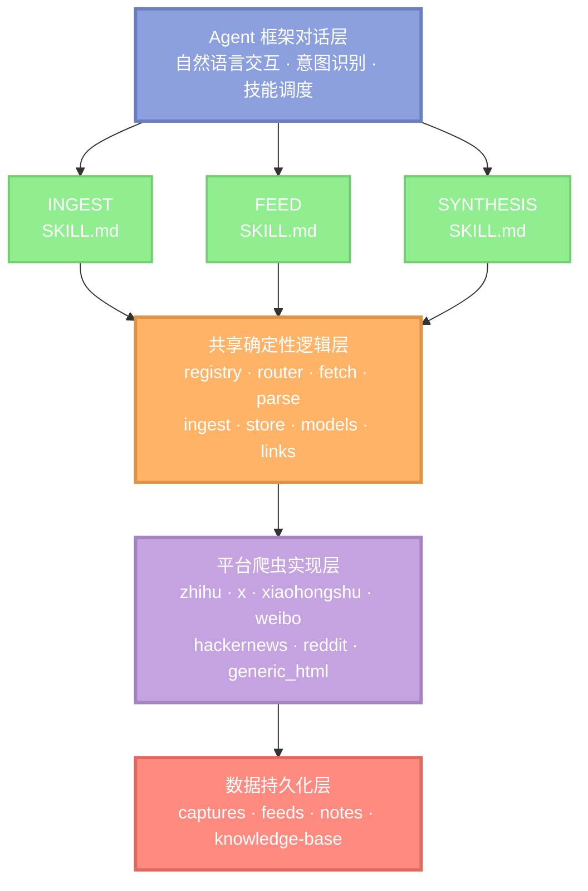
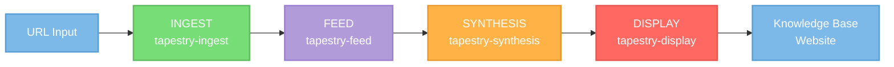
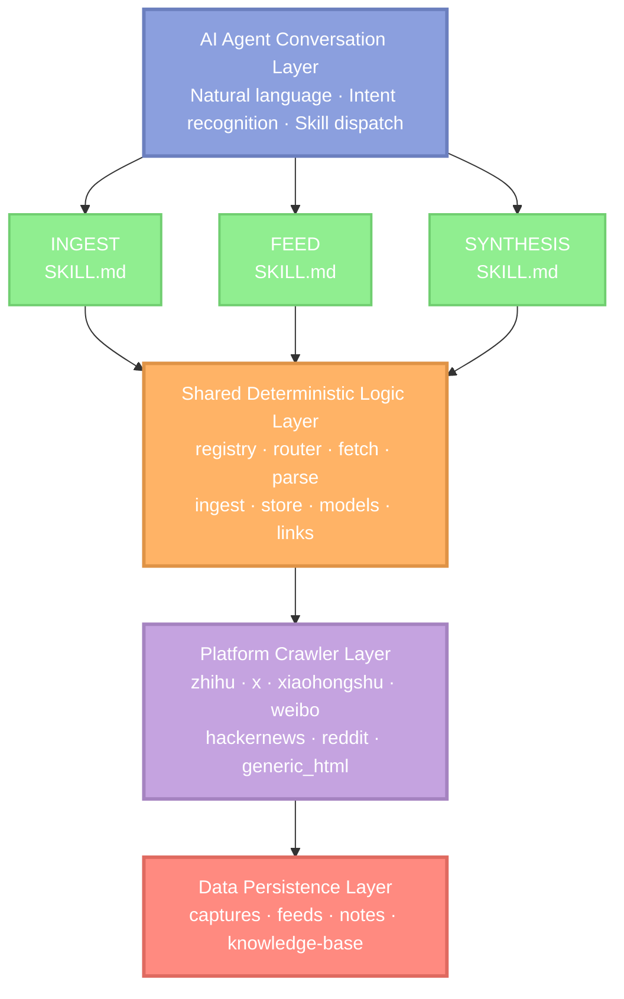

# 🧵 Tapestry

<div align="center">

**AI-Native Web Intelligence Workflow**

*Turn scattered web content into organized, searchable knowledge*

[](https://opensource.org/licenses/MIT)


[中文](#中文) | [English](#english)

---

### 🚧 项目状态 | Project Status

> **🔨 早期访问 / Early Access**
>
> 本项目目前处于积极开发阶段，核心功能已可用，但仍在持续完善中。你可能会遇到部分功能尚未完全实现、可能存在的 Bug 和不稳定性、API 和数据结构可能发生变化、文档仍在完善中等情况。
>
> This project is in active development. Core features are functional, but continuous improvements are ongoing. You may encounter some features not fully implemented, possible bugs and instability, API and data structure changes, and documentation still being refined.
>
> **我们欢迎你的反馈和贡献！** | **We welcome your feedback and contributions!**

---

### ⭐ 支持项目 | Support the Project

> **如果 Tapestry 对你有帮助，请给项目一个 Star！**
>
> 你的 Star 不仅是对开发者工作的认可，更是推动项目持续改进的动力。每一个 Star 都会激励我们开发更多实用功能、修复 Bug 并提升稳定性、完善文档和使用指南、支持更多平台和语言。
>
> **If Tapestry helps you, please give the project a Star!**
>
> Your Star is not just recognition of the developer's work, but also motivation for continuous improvement. Every Star encourages us to develop more useful features, fix bugs and improve stability, enhance documentation and guides, and support more platforms and languages.
>
> [⭐ Star this project on GitHub](https://github.com/your-username/Tapestry/stargazers)

</div>

---

## 中文

### 🎯 Tapestry 是什么？

Tapestry 是一个 **AI 原生的技能包**，它彻底改变了你捕获、整理和综合网络内容的方式。不再需要收藏链接或复制粘贴文章，你将获得一个完整的工作流：爬取来源、规范化内容、构建结构化知识库——全部通过与 Agent 框架的自然对话完成。

**兼容框架**：Claude Code、OpenClaw、Codex 等主流 Agent 框架

### 👥 适合谁使用？

- **研究人员**：需要跨多个平台（知乎、Reddit、HN、X/Twitter）追踪讨论
- **内容策展人**：从多样化来源构建有组织的知识仓库
- **开发者**：希望系统化地归档技术讨论和文档
- **知识工作者**：厌倦了散落在书签和标签页中的宝贵见解

### 💡 解决的问题

**问题 1：平台碎片化** 🌐
有价值的内容分散在知乎、X、Reddit、Hacker News、小红书、微博和无数博客中。每个平台都有不同的结构、API 和访问模式。Tapestry 提供统一的爬虫，为你处理这些复杂性。

**问题 2：内容衰减** ⏳
网络内容会消失、被编辑或变得无法访问。Tapestry 捕获完整快照——包括评论、元数据和上下文——让你拥有持久的本地副本。

**问题 3：信息过载** 📚
保存的链接堆积如山却没有结构。Tapestry 不仅保存内容——它将内容组织成带有主题、章节和交叉引用的层次化知识库，让检索变得轻松。

**问题 4：丢失上下文** 🔍
书签会丢失保存它们背后的"原因"。Tapestry 保留你的原始意图，综合见解，并维护相关材料之间的连接。

---

### ✨ 核心特性

- **🕷️ 多平台爬虫**：原生支持知乎、X/Twitter、小红书、微博、Hacker News、Reddit 和通用 HTML 页面
- **📦 三层架构**：摄取（捕获）→ 订阅源（规范化）→ 综合（分析）
- **📖 书籍式知识库**：带有主题、章节和自动索引生成的层次化组织
- **🎨 可视化前端**：通过简洁、可读的网页界面浏览你的知识库
- **🤖 AI 原生工作流**：为主流 Agent 框架设计——通过自然语言工作，而非 CLI 命令
- **🔄 确定性管道**：可重现的捕获，事实与解释清晰分离

---

### 🚀 快速开始

#### 安装

```bash
# 克隆仓库
git clone https://github.com/your-username/Tapestry.git
cd Tapestry

# 方法 1：直接复制（推荐用于稳定使用）
# Claude Code:
cp -r skills/tapestry ~/.claude/skills/

# OpenClaw:
cp -r skills/tapestry ~/.openclaw/skills/

# Codex:
cp -r skills/tapestry ~/.codex/skills/

# 方法 2：符号链接（推荐用于开发和自动更新）
# Claude Code:
ln -s "$(pwd)/skills/tapestry" ~/.claude/skills/tapestry

# OpenClaw:
ln -s "$(pwd)/skills/tapestry" ~/.openclaw/skills/tapestry

# Codex:
ln -s "$(pwd)/skills/tapestry" ~/.codex/skills/tapestry
```

#### 验证安装

打开你的 Agent 框架，输入：

```
"列出可用的爬虫"
```

如果看到支持的平台列表，说明安装成功！

#### 第一次使用

**摄取一个知乎回答：**

```
"摄取这个知乎回答：https://www.zhihu.com/question/12345/answer/67890"
```

AI 助手会：
1. 自动识别这是知乎链接
2. 选择知乎爬虫
3. 抓取完整内容（包括评论）
4. 保存为三种格式：
   - `captures/` - 原始 JSON
   - `feeds/` - 规范化 JSON
   - `notes/` - Markdown 笔记

**查看结果：**

```
"显示最近摄取的内容"
```

**组织到知识库：**

```
"把这个回答综合到我的知识库"
```

AI 助手会分析内容并自动决定放在哪个主题/章节下。

**浏览知识库：**

```
"把我的知识库显示为网站"
```

AI 助手会生成静态前端并启动本地服务器（通常是 `http://localhost:8766`）。

#### 常见使用场景

**场景 1：追踪技术讨论**
```
"摄取这些 Hacker News 讨论：
https://news.ycombinator.com/item?id=123
https://news.ycombinator.com/item?id=456"

"综合这些讨论，找出共同的观点"
```

**场景 2：归档研究资料**
```
"摄取这个知乎问题下的所有高赞回答"
"在知识库中创建一个新主题：机器学习基础"
"把这些回答组织到新主题下"
```

**场景 3：内容策展**
```
"摄取这个小红书用户的所有笔记：
https://www.xiaohongshu.com/user/profile/xxx"

"生成这个用户的内容摘要"
```

---

### 📋 工作流概览


---

### 🛠️ 架构设计

Tapestry **不是传统的 Python 库**——它是为 Agent 框架的工作流模型精心设计的技能包。

#### 核心设计理念



#### 分层职责

**1. 技能工作流层** (`SKILL.md` 文件)
- 用自然语言定义高级工作流逻辑
- 描述技能的触发条件、执行步骤和输出期望
- 保持人类可读性，便于理解和维护
- 通过 Agent 框架的意图识别自动调用

**2. 共享确定性逻辑层** (`_src/`)
- 提供可重用、可测试的核心功能
- 处理 HTTP 请求、HTML 解析、数据规范化
- 实现爬虫注册表和 URL 路由机制
- 确保数据处理的确定性和可重现性

**3. 平台爬虫实现层** (`_src/crawlers/`)
- 每个平台一个独立模块
- 处理平台特定的 API、DOM 结构、认证机制
- 统一接口：`CrawlerDefinition` + `CrawlHandler`
- 支持热插拔，易于扩展新平台

**4. 数据持久化层**
- 三种制品类型：
  - **Capture**: 原始抓取数据（JSON）
  - **Feed**: 规范化订阅源（JSON）
  - **Note**: 人类可读笔记（Markdown）
- 知识库采用书籍式层次结构
- 所有制品带时间戳，支持版本追溯

#### 数据流转

```
URL 输入
  │
  ├─→ Router (域名解析)
  │
  ├─→ Registry (爬虫匹配)
  │
  ├─→ Crawler (平台抓取)
  │     │
  │     ├─→ Fetcher (HTTP 请求)
  │     ├─→ Parser (内容解析)
  │     └─→ 生成 CrawlerProduct
  │
  ├─→ Store (持久化)
  │     │
  │     ├─→ captures/{timestamp}.json
  │     ├─→ feeds/{timestamp}.json
  │     └─→ notes/{timestamp}.md
  │
  └─→ Handoff (传递给下游技能)
        │
        ├─→ Feed Skill (可选格式化)
        ├─→ Synthesis Skill (AI 分析)
        └─→ Display Skill (可视化展示)
```

#### 扩展性设计

**添加新爬虫**
1. 在 `_src/crawlers/new_platform/` 创建模块
2. 实现 `CrawlerDefinition` 和 `CrawlHandler`
3. 在 `registry.py` 中注册
4. 添加对应的 Feed 规范到 `feed/_specs/`

**添加新技能**
1. 创建 `SKILL.md` 定义工作流
2. 在 `_scripts/` 添加执行脚本
3. 复用 `_src/` 中的共享逻辑
4. 更新文档和测试

这种架构确保了：
- ✅ **关注点分离**：工作流、逻辑、实现各司其职
- ✅ **可测试性**：确定性逻辑层完全可单元测试
- ✅ **可扩展性**：新平台、新技能易于添加
- ✅ **可维护性**：自然语言工作流 + 清晰的代码结构

---

### 📚 支持的来源

| 平台 | 覆盖范围 | 备注 |
|------|---------|------|
| 🇨🇳 知乎 | 问题、回答、文章、个人主页 | 逆向工程 API |
| 🐦 X/Twitter | 帖子、话题串 | 仅公开页面 |
| 📱 小红书 | 笔记、个人主页 | 公开内容 |
| 🇨🇳 微博 | 帖子 | 公开帖子 |
| 🔶 Hacker News | 讨论 | 完整评论树 |
| 🤖 Reddit | 话题串 | 公开话题串 |
| 🌐 通用 HTML | 任何网页 | 后备爬虫 |

---

### 📖 知识库结构

Tapestry 将内容组织成**书籍式层次结构**：

```
knowledge-base/
├── index.md                    # 根导航
├── topic-1/
│   ├── index.md               # 主题概览
│   ├── chapter-1/
│   │   ├── index.md          # 章节内容
│   │   └── artifacts/        # 支持文件
│   └── chapter-2/
└── topic-2/
```

综合技能会自动：
- 根据语义匹配决定内容归属
- 在需要时创建新主题/章节
- 更新所有父级 `index.md` 文件以便导航
- 维护治理规则以保持一致性

---

### 🎨 可视化前端

从你的知识库生成可浏览的网站：

```bash
# 当你说"把我的知识库显示为网站"时，Claude 会为你运行：

python skills/tapestry/display/_scripts/publish_viewer.py
python -m http.server 8766 --directory knowledge-base/_viewer
```

访问 `http://localhost:8766` 以浏览你的有组织内容，带有适当的导航和结构。

---

### 🧪 测试

验证与代码并存：

```bash
cd skills/tapestry/_tests
pytest
```

测试覆盖共享的 `_src` 支持代码和注册表行为。

---

### ❓ 常见问题

#### 什么是 Tapestry？

Tapestry 是一个为 Claude Code 设计的技能包，用于从多个平台爬取网络内容并组织成结构化的知识库。它不是传统的库或工具，而是通过自然语言对话工作的 AI 原生工作流。

#### 我需要编程经验吗？

不需要。你只需要与 Claude 自然对话即可使用 Tapestry。

#### 会被平台封禁吗？

Tapestry 尊重平台的速率限制和 robots.txt。对于公开内容，风险很低。但请：
- 不要过度频繁地爬取
- 遵守平台的服务条款
- 仅爬取公开可访问的内容

#### 数据存储在哪里？

所有数据都存储在你的本地文件系统中。Tapestry 不会将数据发送到任何外部服务器（除了原始平台）。

#### 如何备份我的知识库？

只需备份整个项目目录，特别是 `captures/`、`feeds/`、`notes/` 和 `knowledge-base/` 目录。

#### 如何添加新平台的爬虫？

参见下方的贡献指南。基本步骤：
1. 在 `_src/crawlers/` 创建新模块
2. 实现 `CrawlerDefinition` 和 `CrawlHandler`
3. 在 `registry.py` 中注册
4. 添加 Feed 规范
5. 编写测试

#### 遇到问题怎么办？

- 查看 [Issues](https://github.com/your-username/Tapestry/issues) 寻找类似问题
- 创建新的 [Bug 报告](https://github.com/your-username/Tapestry/issues/new?template=bug_report.md)
- 加入 [讨论区](https://github.com/your-username/Tapestry/discussions) 提问

---

### 🤝 贡献指南

我们欢迎所有形式的贡献！无论是新功能、bug 修复、文档改进还是使用反馈，都能帮助 Tapestry 变得更好。

#### 贡献方式

**1. 添加新平台爬虫** 🕷️
- 在 `_src/crawlers/` 下创建新的平台模块
- 实现 `CrawlerDefinition` 和 `CrawlHandler` 接口
- 在 `registry.py` 中注册爬虫
- 添加对应的 Feed 规范到 `feed/_specs/`
- 编写单元测试验证爬虫行为

**2. 改进订阅源规范** 📝
- 优化 `feed/_specs/` 中的源特定格式化规则
- 确保规范能准确反映平台特性
- 保持与 `_shared-standard.md` 的一致性

**3. 增强可视化前端** 🎨
- 改进 `display/_ui/` 中的查看器界面
- 优化导航体验和内容呈现
- 确保响应式设计和可访问性

**4. 完善知识库治理** 📚
- 优化 `_kb_rules/` 中的组织规则
- 改进主题分类和章节决策逻辑
- 提升知识库的可维护性

**5. 文档和示例** 📖
- 补充使用场景和最佳实践
- 添加常见问题解答
- 提供更多平台的示例

#### 提交 Pull Request

在提交 PR 之前，请确保：

1. **代码质量**
   - 遵循项目现有的代码风格
   - 添加必要的类型注解和文档字符串
   - 确保代码通过所有测试

2. **测试覆盖**
   ```bash
   cd skills/tapestry/_tests
   pytest
   ```
   - 为新功能添加单元测试
   - 确保现有测试全部通过
   - 测试覆盖关键路径和边界情况

3. **提交信息**
   - 使用清晰的提交信息描述变更
   - 格式：`<type>(<scope>): <subject>`
   - 类型：`feat`, `fix`, `docs`, `style`, `refactor`, `test`, `chore`
   - 示例：
     ```
     feat(crawlers): add Bilibili video crawler
     fix(zhihu): handle deleted answers gracefully
     docs(readme): update installation instructions
     ```

4. **PR 描述**
   - 清楚说明变更的动机和目标
   - 列出主要变更点
   - 附上相关的 issue 编号（如有）
   - 提供测试步骤或截图（如适用）

#### PR 模板

```markdown
## 变更类型
- [ ] 新功能
- [ ] Bug 修复
- [ ] 文档更新
- [ ] 性能优化
- [ ] 代码重构

## 变更描述
<!-- 简要描述这个 PR 做了什么 -->

## 动机和背景
<!-- 为什么需要这个变更？解决了什么问题？ -->

## 测试
<!-- 如何验证这个变更？提供测试步骤 -->

## 相关 Issue
<!-- 关联的 issue 编号，如 #123 -->

## 检查清单
- [ ] 代码遵循项目风格指南
- [ ] 添加了必要的测试
- [ ] 所有测试通过
- [ ] 更新了相关文档
- [ ] 提交信息清晰明确
```

#### 开发环境设置

```bash
# 克隆仓库
git clone https://github.com/your-username/Tapestry.git
cd Tapestry

# 安装依赖（如需要）
pip install -r requirements.txt  # 如果有的话

# 运行测试
cd skills/tapestry/_tests
pytest -v

# 安装到 Agent 框架进行测试（使用符号链接便于开发）
ln -s "$(pwd)/skills/tapestry" ~/.claude/skills/tapestry
```

#### 行为准则

- 尊重所有贡献者
- 保持建设性的讨论
- 接受建设性的批评
- 关注对项目最有利的事情
- 对社区成员表现出同理心

#### 需要帮助？

- 查看 [Issues](https://github.com/your-username/Tapestry/issues) 寻找可以贡献的任务
- 标记为 `good first issue` 的问题适合新贡献者
- 标记为 `help wanted` 的问题需要社区帮助
- 有疑问？在 issue 中提问或发起讨论

---

### 📄 许可证

本项目采用 MIT 许可证 - 详见 [LICENSE](LICENSE) 文件。

---

## English

### 🎯 What is Tapestry?

Tapestry is an **AI-native skill pack** that transforms how you capture, organize, and synthesize web content. Instead of bookmarking links or copy-pasting articles, you get a complete workflow that crawls sources, normalizes content, and builds a structured knowledge base—all through natural conversation with your AI assistant.

**Compatible Frameworks**: Claude Code, OpenClaw, Codex, and other mainstream agent frameworks

### 👥 Who Should Use This?

- **Researchers** who need to track discussions across multiple platforms (Zhihu, Reddit, HN, X/Twitter)
- **Content curators** building organized knowledge repositories from diverse sources
- **Developers** who want to archive technical discussions and documentation systematically
- **Knowledge workers** tired of losing valuable insights scattered across bookmarks and tabs

### 💡 Problems It Solves

**Problem 1: Platform Fragmentation** 🌐
Valuable content lives across Zhihu, X, Reddit, Hacker News, Xiaohongshu, Weibo, and countless blogs. Each platform has different structures, APIs, and access patterns. Tapestry provides unified crawlers that handle the complexity for you.

**Problem 2: Content Decay** ⏳
Web content disappears, gets edited, or becomes inaccessible. Tapestry captures complete snapshots—including comments, metadata, and context—so you have durable local copies.

**Problem 3: Information Overload** 📚
Saved links pile up without structure. Tapestry doesn't just save content—it organizes it into a hierarchical knowledge base with topics, chapters, and cross-references, making retrieval effortless.

**Problem 4: Lost Context** 🔍
Bookmarks lose the "why" behind saving them. Tapestry preserves your original intent, synthesizes insights, and maintains connections between related materials.

---

### ✨ Key Features

- **🕷️ Multi-Platform Crawlers**: Native support for Zhihu, X/Twitter, Xiaohongshu, Weibo, Hacker News, Reddit, and generic HTML pages
- **📦 Three-Layer Architecture**: Ingest (capture) → Feed (normalize) → Synthesis (analyze)
- **📖 Book-Like Knowledge Base**: Hierarchical organization with topics, chapters, and automatic index generation
- **🎨 Visual Frontend**: Browse your knowledge base through a clean, readable web interface
- **🤖 AI-Native Workflow**: Designed for mainstream agent frameworks—work through natural language, not CLI commands
- **🔄 Deterministic Pipeline**: Reproducible captures with clear separation between facts and interpretation

---

### 🚀 Quick Start

#### Installation

```bash
# Clone the repository
git clone https://github.com/your-username/Tapestry.git
cd Tapestry

# Method 1: Direct copy (recommended for stable use)
# Claude Code:
cp -r skills/tapestry ~/.claude/skills/

# OpenClaw:
cp -r skills/tapestry ~/.openclaw/skills/

# Codex:
cp -r skills/tapestry ~/.codex/skills/

# Method 2: Symlink (recommended for development and auto-updates)
# Claude Code:
ln -s "$(pwd)/skills/tapestry" ~/.claude/skills/tapestry

# OpenClaw:
ln -s "$(pwd)/skills/tapestry" ~/.openclaw/skills/tapestry

# Codex:
ln -s "$(pwd)/skills/tapestry" ~/.codex/skills/tapestry
```

#### Verify Installation

Open your agent framework and type:

```
"List available crawlers"
```

If you see the list of supported platforms, installation is successful!

#### First Use

**Ingest a Zhihu answer:**

```
"Ingest this Zhihu answer: https://www.zhihu.com/question/12345/answer/67890"
```

Your AI assistant will:
1. Automatically recognize it's a Zhihu link
2. Select the Zhihu crawler
3. Capture full content (including comments)
4. Save in three formats:
   - `captures/` - Raw JSON
   - `feeds/` - Normalized JSON
   - `notes/` - Markdown notes

**View results:**

```
"Show recently ingested content"
```

**Organize into knowledge base:**

```
"Synthesize this answer into my knowledge base"
```

Your AI assistant will analyze the content and automatically decide which topic/chapter to place it under.

**Browse knowledge base:**

```
"Show my knowledge base as a website"
```

Your AI assistant will generate a static frontend and start a local server (usually `http://localhost:8766`).

#### Common Use Cases

**Scenario 1: Track Technical Discussions**
```
"Ingest these Hacker News discussions:
https://news.ycombinator.com/item?id=123
https://news.ycombinator.com/item?id=456"

"Synthesize these discussions and find common viewpoints"
```

**Scenario 2: Archive Research Materials**
```
"Ingest all highly-voted answers under this Zhihu question"
"Create a new topic in the knowledge base: Machine Learning Basics"
"Organize these answers under the new topic"
```

**Scenario 3: Content Curation**
```
"Ingest all notes from this Xiaohongshu user:
https://www.xiaohongshu.com/user/profile/xxx"

"Generate a content summary for this user"
```

---

### 📋 Workflow Overview



---

### 🛠️ Architecture Design

Tapestry is **not a traditional Python library**—it's a skill pack meticulously designed for AI agent framework workflow models.

#### Core Design Philosophy



This architecture ensures:
- ✅ **Separation of Concerns**: Workflow, logic, and implementation are distinct
- ✅ **Testability**: Deterministic logic layer is fully unit-testable
- ✅ **Extensibility**: New platforms and skills are easy to add
- ✅ **Maintainability**: Natural language workflows + clear code structure

---

### 📚 Supported Sources

| Platform | Coverage | Notes |
|----------|----------|-------|
| 🇨🇳 Zhihu | Questions, Answers, Articles, Profiles | Reverse-engineered API |
| 🐦 X/Twitter | Posts, Threads | Public pages only |
| 📱 Xiaohongshu | Notes, Profiles | Public content |
| 🇨🇳 Weibo | Posts | Public posts |
| 🔶 Hacker News | Discussions | Full comment trees |
| 🤖 Reddit | Threads | Public threads |
| 🌐 Generic HTML | Any webpage | Fallback crawler |

---

### 📖 Knowledge Base Structure

Tapestry organizes content into a **book-like hierarchy**:

```
knowledge-base/
├── index.md                    # Root navigation
├── topic-1/
│   ├── index.md               # Topic overview
│   ├── chapter-1/
│   │   ├── index.md          # Chapter content
│   │   └── artifacts/        # Supporting files
│   └── chapter-2/
└── topic-2/
```

The synthesis skill automatically:
- Decides where content belongs based on semantic fit
- Creates new topics/chapters when needed
- Updates all parent `index.md` files for navigation
- Maintains governance rules for consistency

---

### 🎨 Visual Frontend

Generate a browsable website from your knowledge base:

```bash
# Your AI assistant will run this for you when you say:
# "Show me my knowledge base as a website"

python skills/tapestry/display/_scripts/publish_viewer.py
python -m http.server 8766 --directory knowledge-base/_viewer
```

Visit `http://localhost:8766` to browse your organized content with proper navigation and structure.

---

### 🧪 Testing

Validation lives alongside the code:

```bash
cd skills/tapestry/_tests
pytest
```

Tests cover the shared `_src` support code and registry behavior.

---

### ❓ Frequently Asked Questions

#### What is Tapestry?

Tapestry is a skill pack for agent frameworks that crawls web content from multiple platforms and organizes it into a structured knowledge base. It's not a traditional library or tool, but an AI-native workflow that works through natural language conversation.

#### Do I need programming experience?

No. You simply talk to your AI assistant naturally to use Tapestry.

#### Will I get blocked by platforms?

Tapestry respects platform rate limits and robots.txt. For public content, the risk is low. However:
- Don't crawl too frequently
- Follow platform Terms of Service
- Only crawl publicly accessible content

#### Where is data stored?

All data is stored on your local filesystem. Tapestry does not send data to any external servers (except the original platforms).

#### How do I backup my knowledge base?

Simply backup the entire project directory, especially `captures/`, `feeds/`, `notes/`, and `knowledge-base/` directories.

#### How do I add a crawler for a new platform?

See the Contributing section below. Basic steps:
1. Create new module in `_src/crawlers/`
2. Implement `CrawlerDefinition` and `CrawlHandler`
3. Register in `registry.py`
4. Add Feed spec
5. Write tests

#### What if I encounter issues?

- Check [Issues](https://github.com/your-username/Tapestry/issues) for similar problems
- Create a new [Bug Report](https://github.com/your-username/Tapestry/issues/new?template=bug_report.md)
- Join [Discussions](https://github.com/your-username/Tapestry/discussions) to ask questions

---

### 🤝 Contributing

We welcome all forms of contributions! Please read our [Contributing Guide](CONTRIBUTING.md) for details on:

- Adding new platform crawlers
- Improving feed specifications
- Enhancing the frontend
- Refining knowledge base governance
- Documentation improvements

Before submitting a PR, ensure:
- Code follows project style
- All tests pass
- Documentation is updated
- Commit messages follow Conventional Commits

See [CONTRIBUTING.md](CONTRIBUTING.md) for the complete guide.

---

### 📄 License

This project is licensed under the MIT License - see the [LICENSE](LICENSE) file for details.

---

<div align="center">

**Built with ❤️ for Agent Frameworks**

*Transform scattered web content into organized knowledge*

[⬆ Back to Top](#-tapestry)

</div>
